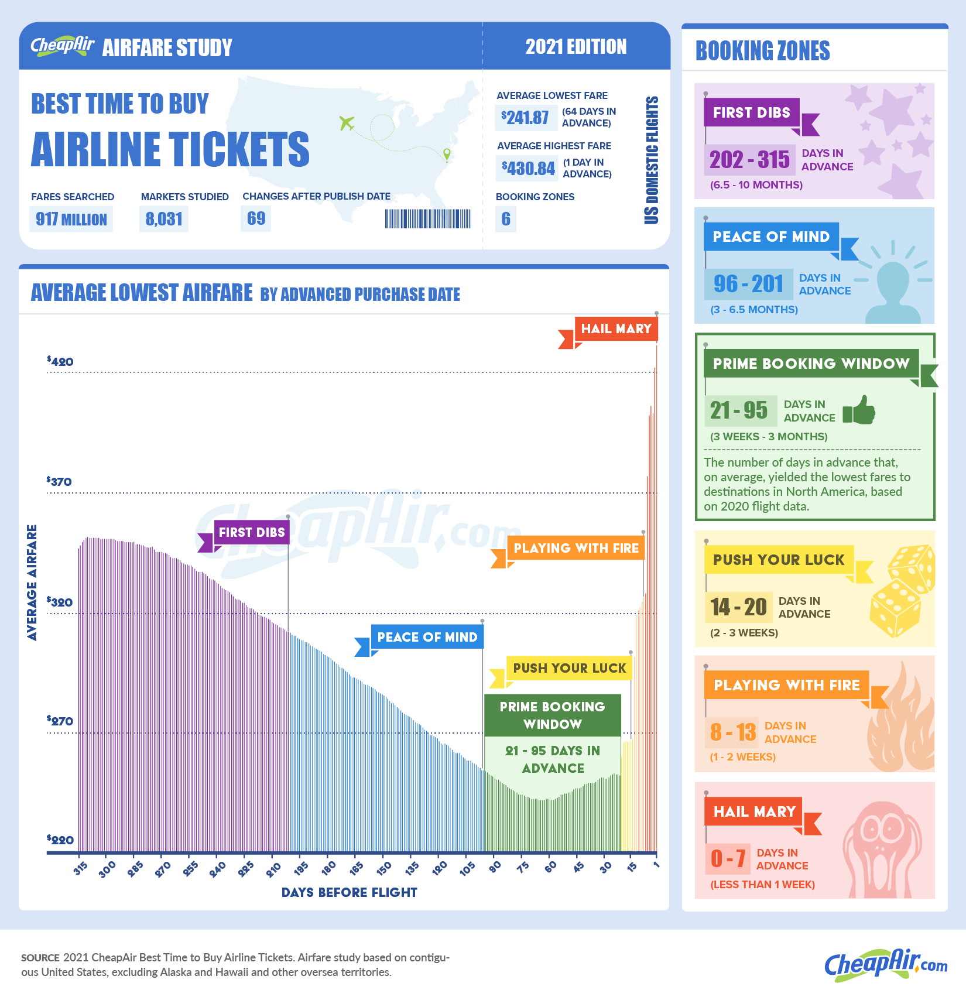
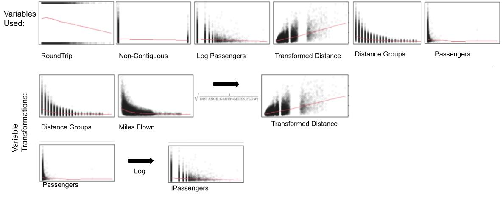

```{r, echo=FALSE}
knitr::opts_chunk$set(echo = TRUE, message = FALSE, warning = FALSE)
```

```{r load_libraries, include=FALSE}
# Use this R-Chunk to load all your libraries!
#install.packages("tidyverse") # run this line once in console to get package
library(tidyverse)
library(readr)

library(ggforce)
library(gghighlight)

library(pander)
library(mosaic)

#library(cat)

library(MASS)
library(lmtest)
#library(tseries)
library(sandwich)
library(wooldridge)

library(car)
library(plotly)
library(reshape2)
```

```{r load_data, include=FALSE}
# Use this R-Chunk to import all your datasets!

Q1 <- read_csv("../../Data/Econ-388-Final/Q1.csv")
Q2 <- read_csv("../../Data/Econ-388-Final/Q2.csv")
FullDat <- rbind(Q1,Q2)
rm(Q1)
rm(Q2)

Q3 <- read_csv("../../Data/Econ-388-Final/Q3.csv")
FullDat <- rbind(FullDat,Q3)
rm(Q3)

Q4_2020 <- read_csv("../../Data/Econ-388-Final/Q4(2020).csv")
FullDat <- rbind(FullDat,Q4_2020)
rm(Q4_2020)

FullDat <- FullDat[,c(-1,-4:-6,-14)]

```


```{r data_filtering, include=FALSE}
FullDat$ITIN_GEO_TYPE <- as.character(FullDat$ITIN_GEO_TYPE)
FullDat$ITIN_GEO_TYPE <- case_when(FullDat$ITIN_GEO_TYPE == "1" ~ "Non-Continguous Domestic", FullDat$ITIN_GEO_TYPE == "2" ~ "Continguous Domestic")
FullDat$ITIN_GEO_TYPE <- as.factor(FullDat$ITIN_GEO_TYPE)

FullDat$ROUNDTRIP <- as.character(FullDat$ROUNDTRIP)
FullDat$ROUNDTRIP <- case_when(FullDat$ROUNDTRIP == "0" ~ "One-Way", FullDat$ROUNDTRIP == "1" ~ "RoundTrip")
FullDat$ROUNDTRIP <- as.factor(FullDat$ROUNDTRIP)
```

```{r data_filter_1, eval=FALSE, include=FALSE}
x.axis.breaks <- c(0,                      # binwidth = 100
                   seq(100, 500, 25),     # binwidth = 10
                   seq(600, 1500, 100))  # binwidth = 50


# Non-Continguous Flights
FullDat2_Non <- FullDat %>%
  filter(ITIN_GEO_TYPE == "Non-Continguous Domestic")

FullDat2_Non1_Filt <- filter(FullDat2_Non, ITIN_YIELD <10 & ITIN_YIELD >0.05)


FullDat2_Non_T <- FullDat2_Non %>%
  mutate(Fare.cut = cut(ITIN_FARE,
                         breaks = x.axis.breaks)) %>%
  count(Fare.cut, ITIN_GEO_TYPE) %>%
  mutate(xmin = x.axis.breaks[as.integer(Fare.cut)],
         xmax = x.axis.breaks[as.integer(Fare.cut) + 1]) %>%
  group_by(Fare.cut) %>%
  arrange(desc(ITIN_GEO_TYPE)) %>%
  mutate(ymax = cumsum(n)) %>%
  mutate(ymin = lag(ymax)) %>%
  mutate(ymin = ifelse(is.na(ymin), 0, ymin)) %>%
  ungroup()


table1 <-favstats(`ITIN_YIELD` ~ QUARTER + DISTANCE_GROUP,data=FullDat2_Non)
table1 <- table1 %>% 
     separate(QUARTER.DISTANCE_GROUP, into = c("QUARTER", "DISTANCE_GROUP"), "[.]")
table1$DISTANCE_GROUP <- as.numeric(table1$DISTANCE_GROUP)


# Continguous Flights
FullDat2_Con <- FullDat %>%
  filter(ITIN_GEO_TYPE == "Continguous Domestic")

FullDat2_Con1 <- FullDat %>%
  filter(ITIN_GEO_TYPE == "Continguous Domestic")

FullDat2_Con <- FullDat2_Con %>%
  mutate(Fare.cut = cut(ITIN_FARE,
                         breaks = x.axis.breaks)) %>%
  count(Fare.cut, ITIN_GEO_TYPE) %>%
  mutate(xmin = x.axis.breaks[as.integer(Fare.cut)],
         xmax = x.axis.breaks[as.integer(Fare.cut) + 1]) %>%
  group_by(Fare.cut) %>%
  arrange(desc(ITIN_GEO_TYPE)) %>%
  mutate(ymax = cumsum(n)) %>%
  mutate(ymin = lag(ymax)) %>%
  mutate(ymin = ifelse(is.na(ymin), 0, ymin)) %>%
  ungroup()
FullDat2_Con$color <- "cyan3"

table3 <-favstats(`ITIN_YIELD` ~ QUARTER + DISTANCE_GROUP,data=FullDat2_Con1)
table3 <- table3 %>% 
     separate(QUARTER.DISTANCE_GROUP, into = c("QUARTER", "DISTANCE_GROUP"), "[.]")
table3$DISTANCE_GROUP <- as.numeric(table3$DISTANCE_GROUP)
```

```{r data_filter_2, include=FALSE}

FullDat_Filt <- filter(FullDat, ITIN_FARE >= 25 & ITIN_FARE <1500)
FullDat_Filt <- filter(FullDat_Filt, ITIN_YIELD <2)

rm(FullDat)
```

```{r Sample_buildin, include=FALSE}
samp <- FullDat_Filt[sample(nrow(FullDat_Filt), 20000), ]
#rm(FullDat_Filt)

samp <- samp[,-1]
samp$lPASSENGERS <- log(samp$PASSENGERS)
samp$SQRT_1over_DG_x_MF <- sqrt( 1/(samp$DISTANCE_GROUP*samp$MILES_FLOWN))

samp$ROUNDTRIP <- as.factor(samp$ROUNDTRIP)

```


# Introduction 

## Our Question

  As students of economics, we have studied many different industries and market structures in order to understand how people try to maximize their profits. In many of the models that we have studied for our prior classes, pricing of goods and services was straightforward, and we had clear evidence showing why a producer would want to sell their product at certain quantities and prices. But when it comes to airlines selling flights, how firms maximize their profit gets a little more ambiguous. We know that airlines compete as an oligopoly market, so they want to collude but can’t, which begs the question what is their next best alternative? What methods can they employ to get an edge over their competitors and maximize their profit when their best option is unavailable? Anyone that has tried to buy a ticket for an airplane has probably realized that not every ticket is priced the same and that some people get better deals than others. We know that one method that airlines use to maximize profit is price discrimination, but that does not tell us anything about their revenue relative to their costs. In other words, knowing that a businessperson will typically pay more for a ticket does not tell us all that much about what kind of money the airline is going to make overall. Are airlines getting the most they can out of flights, and what incentives are there to offer deals and discounts? These are important questions when we want to learn more about the industry. 

We also want to know what kind of deals that airlines make to increase profit, for example we will look at if airlines offer bulk discounts for groups buying tickets in massive quantities. Or if the airlines will offer slightly better deals on round-trip flights so they can make money by taking a person to a place and bringing them back. These are some standard practices offered in some other industries and we wanted to see if these are applicable to this industry like others, and if that is the case then it might give us as consumers innovative ideas on how to exploit those deals offered by the airlines.  

To state the plan explicitly, we will be taking airline data and will attempt to use flight characteristics to create a regression to determine what kind of revenue airlines will be able to make off a given flight. One of the main variables we will be trying to predict is itinerary yield, which represents the amount of revenue that a flight will bring in. We will look at how the revenue is affected by distance and how much a flight can make per mile. That will give us an idea of whether or not airlines offer discounted rates to those flying long distances. Our hope is that our regression will be able to answer all these questions and more, as well as provide a stable model for future research. Or at the very least, will provide a rough basis to be polished and refined further at a later date. 

## Original Study 

Below is a visual that shows the type of study we originally wanted to conduct. Their data is not open source and because finding data of this type was not possible we changed the data and remainder of the project.

We can see a rough answer to our original question, "When is the cheapest time to buy airline tickets? Does pricing change significantly as demand for flights varies? Do airlines vary price to combat strategic consumers?"... Yes ticket price is extremely elastic.

 



Data Source:
[Source](https://www.transtats.bts.gov/DL_SelectFields.asp?gnoyr_VQ=FKF&QO_fu146_anzr=b4vtv0%20n0q%20Qr56v0n6v10%20f748rB)


---

# Literature Review 


```{r eval=FALSE, include=FALSE}
#* Higher cost airlines are inclined to determine which market consumers belong to, tourism or business. 
#If the airline is able to do this then they will do their best to sell exclusively to those flying for business since they are likely to have a higher willingness to pay than tourists. Seats on a plane are also limited, so selling seats to businessmen should create more profit than filling a plane with tourists.
#* Last minute deals are more than offset by than increased prices leading up to them.

#* Price discrimination while difficult for airlines to execute still occurs.
```


```{r eval=FALSE, include=FALSE}
#Sometimes when airlines have a few seats open right before a plane is about to take off they will offer last minute deals that are lower than they would normally sell tickets for. The airline doesn't profit as much as they would selling the ticket, but it is less of a loss to the airplane than an unoccupied seat.
#In summary of the first two points, studies find that airlines should charge lower fares to tourists buying tickets one to two periods in advance, charge higher fares to businessmen the period of a flight, and cut costs on the day of a flight, in order to maximize their profits.
```


```{r eval=FALSE, include=FALSE}
#The same study finds that frequent flights reduce airlines' ability to price discriminate and cut their profits for those flights.
#We find evidence of airline discrimination in other studies, some of which show that airline tickets will have higher fares for weekday flights than weekend flights in an attempt to price discriminate against people going on business trips.
```


To provide an answer to the question “can we predict revenue earned from flights based off their characteristics?”, a list of variables that have significant effects on the price of airline tickets need to be evaluated. Using research and analysis from others, who have examined individual factors and price determinates, will be a basis for what data should be obtained and applied to create a new regression study. The primary factors to be examined are scarcity of seats, the impact of oil prices and consumer strategies on the price of the seat.  

Much of the research is based on the interactions between consumers and airlines pricing. To begin, it was necessary to find evidence that consumers within the airline ticket market are strategic as assumed. (i.e. Are the assumed interactions between price and consumers reasonable, or are they a result of other hidden factors?) Li and Netessine (2014) provide an analysis of this base question. Their research seeks to answer the idea of whether consumers are strategic within the airline industry to a significant degree, and secondarily what effects this may have on the revenues of airlines. Due to their work, we can say with relative confidence that strategic consumers do exist within this market space, specifically with an estimated share of 5.2% to 19.2% of the consumer market. (Li et al, 2014) The effects on total revenue due to their presence are more complicated, they found that nondecreasing price commitment strategies can reduce the level of strategic consumers although these same strategies lead to decreased levels of indifferent consumers as well (Li et al, 2014) (i.e. Those who buy tickets simply because they are cheap, rather than waiting for prices to drop before buying). These findings show the effects of strategic consumers on revenue may be a relationship worth investigating as if understood it would allow for more exact price strategies that maximize revenues by controlling and shifting market strategies based on flight patterns, trends, and consumers inputs.  

This leaves the question, what timing is most strategic when selling tickets? To answer this, two things must be identified. The first is, which market (business or tourist) is the airline primarily selling to? The second is, which of three periods are the passengers purchase in? It seems like the ideal model sells a substantial portion of seats in the initial period to business persons who are less likely to cancel, then the model opens ticket purchases to the tourist market. Obviously, seating capacity is limited depending on the plane. When capacity is low airlines typically are “better off selling exclusively to business consumers, who have higher valuations and thus will pay more.” (Bischoff et al, 2011)  

The final period of sales concerns last-minute deals, which is the idea that people can fill seats that would otherwise go unoccupied for a less expensive price than normal. This practice, while cutting into the profit that could be realized by the airline, usually cuts the costs that would have been seen by an unoccupied seat. This tool is usually only utilized when capacity is high and only on the day of the flight. 

So in answer to what timing is most strategic when selling tickets? We found that airlines should price discriminate in the first period of purchasing, especially in the tourist market. In the second and third purchasing periods they should market moderately priced tickets to the business segment of the market, and finally in the day of, they need to utilize the most profitable preserving model of last minute deals for unfilled seats.  

This pricing strategy, however, changes with increases and decreases in flight frequencies. (Cattaneo et al, 2018) The authors found that fare variations have a negative correlation with changes in the frequency of a flight. Simply said, frequent flights reduce an airline’s ability to price discriminate.  

This leads to pricing strategies and consumer responses to them. Airlines will often charge more for a one-way ticket than for a round trip ticket causing consumers to buy a two-way ticket but skip the return trip to save money. (Bischoff, et al 2011)  As one could imagine, carriers are not very fond of this practice and do their best to curb it while maintaining the same price discriminatory practices. These authors also note the history of air travel and how demand has settled into a seasonal pattern where most people travel for holidays. This leads into an analysis of basic elasticities of consumers. This means a consumer purchasing a last-minute round-trip flight typically is a very inelastic consumer, whereas a consumer buying tickets months in advance for a vacation flight is more elastic and responsive to price. Then the authors explain some price discrimination methods such as offering discounts to flyers booking flights well in advance as well as offering a discount for last minute customers to book their return flight with the same airline. This shift to a lower cost flight model has impacted the way that other higher cost airlines do business and for them to do some introspection on how they control prices. (Bischoff et al, 2011) 

Additionally, airlines also price discriminate via the day of the week a ticket is purchased. Puller and Taylor (2012) found ticket prices to be lower on weekends than weekdays. They concluded this is due to people buying for leisurely purposes on weekends and thus are more price-elastic, in other words, people who are more sensitive to price changes. 

One thing not yet answered is whether prices rise within certain hours of the day. Turns out there are higher prices during regular office hours, (the time businesspersons are most likely to buy) and lower prices in the evening (when vacationers are more likely to buy). “As the proportion of business travelers increases closer to departure, both price dispersion and price discrimination become larger.” (Escobari et al, 2019) 

While much of the peer reviewed literature has information on the general timing of selling tickets, we want to find if there other pricing strategies. Particularly, are there are price changes within the few minutes one begins looking at a flight? The goal is to find a way to predict the best possible time to buy any given flight. 

*note*
When we were unable to find data publicly available for the above goal and question we formulated a new goal based on the data we did have access to, now focusing on how we can better understand the revenue and pricing strategies of airlines as a way to locate any potential loopholes or gaps that could be exploited by consumers.

---

# Data Analysis 

All data was obtain via the US Federal Aviation Database systems.
[Source](https://www.faa.gov/data_research/)

*Due to the size of the data this document is created with code that randomly samples 20,000 points from our 11 million, as a result the charts below sometimes vary thus we refrained from interpreting them. Although the full data set is represented by the tabular outputs. Additionally when viewing regression outputs we were able to code in references to outputs as the values change while interpretations are static. The patterns and relationships observed remain constant across samples due to the strength and significance of our variables as well as the large sample size*

## Variable Definition


```{r table2, echo=FALSE, message=FALSE, warnings=FALSE, results='asis'}

tabl2 <-"
| Variable Name | Description  | 
|---------------|:-------------:|
| QUARTER       |	Quarter (1-4)	  |
| ROUNDTRIP     |	Round Trip Indicator (1=Yes)  |		 
| ITIN_YIELD    |	Itinerary Fare Per Miles Flown in Dollars (ITIN_FARE/MilesFlown).  |
| PASSENGERS    |	Number of Passengers	|	 
| ITIN_FARE      |	Itinerary Fare Per Person		| 
| DISTANCE_GROUP |	Distance Group, in 500 Mile Intervals		| 
| MILES_FLOWN   |	Itinerary Miles Flown (Track Miles)		 |
| ITIN_GEO_TYPE |	Itinerary Geography Type, 0	= Contiguous Domestic (Lower 48 U.S. States Only) , 1 = Non-contiguous Domestic (Includes Hawaii, Alaska and Territories)   |
"
# output the table in a format good for HTML/PDF/docx conversion
tabl2 %>% pander()
```

```{r}
tabl3 <-"
| Transformed Variable Name | Original Variable Name | Description  | 
|--------------------|:---------------:|:--------------------------:|
| lPASSENGERS        | PASSENGERS    |	Log(PASSENGERS)	  |
| SQRT_1over_DG_x_MF | DISTANCE_GROUP & MILES_FLOWN |	$\\sqrt{\\frac{1}{\\text{DISTANCE_GROUP} * \\text{MILES_FLOWN}}}$  |		 
"


tabl3 %>% pander()
```


## Graphical Summaries #

### Overview 

Overall these summaries are meant to help provide a simpler view of our over all model given the high number of dimensions present. A version of all these variables shown on just 2 plots is available in the 'Regression Plot' section.


### Yield by log(Passengers)

```{r}
ggplot(samp %>% drop_na()) +
  geom_smooth(aes(x= lPASSENGERS, y=ITIN_YIELD, col=ROUNDTRIP)) +
  #geom_jitter(aes(x= lPASSENGERS, y=ITIN_YIELD, col=ROUNDTRIP), alpha= 0.05) +
  facet_grid(rows= ~ITIN_GEO_TYPE)+
  theme_bw()+
  labs(col = "Flight Type", title= "Yield by log(Passengers)")+ 
  xlab("Log(Passengers)") + ylab("Fare per mile per passenger (Dollars)")


```

### Yield by Distance Groups

```{r}
ggplot(samp %>% drop_na()) +
  #geom_jitter(aes(x= DISTANCE_GROUP, y=ITIN_YIELD, col=ROUNDTRIP), alpha= 0.0075) +
  geom_smooth(aes(x= DISTANCE_GROUP, y=ITIN_YIELD, col=ROUNDTRIP)) +
  facet_grid(rows= ~ITIN_GEO_TYPE)+
  theme_bw()+
  theme(
      panel.spacing = unit(0.5, "lines")
    )+ 
  labs(col = "Flight Type", title= "Yield by Distance")+ 
  xlab("Distance in intervals of 500") + ylab("Fare per mile per passenger (Dollars)")


```

### Yield by Binaries

```{r}
ggplot(data=samp, ) +
    geom_histogram(aes(x=ITIN_YIELD, fill= ROUNDTRIP)) +
    #geom_area(aes(x=HEPerGDP,y=child_mort, fill= continent))+
    theme_bw() +
    gghighlight(use_direct_label = FALSE) +
    facet_wrap(~ITIN_GEO_TYPE) +
    theme(
      panel.spacing = unit(0.5, "lines"),
      axis.ticks.x=element_blank()
    )+ 
  labs(fill = "Flight Type", title= "Distribution of Yields by Flight Types")+ 
  xlab("Fare per mile per passenger (Dollars)") + ylab("Count") 
```


## Tabular Summaries #

### Overview 

Again these tables are meant to provide a similar glance at our data as a whole the the general distributions of the grouping and relationships we were examining.

### Yield ~ RoundTrip & Geo

```{r}
pander(favstats(ITIN_YIELD ~  ROUNDTRIP + ITIN_GEO_TYPE, data=FullDat_Filt)[c("ROUNDTRIP.ITIN_GEO_TYPE", "Q1","median", "mean","Q3", "sd","n")], caption= "Summary table of Yields by Flight Type per Quarter")
```

### Yield ~ Distance Group

Here given the total of 25 distance groups we trimmed the output down to the shortest 5. middle 5 and longest 3.

```{r}
pander(favstats(ITIN_YIELD ~ DISTANCE_GROUP, data=FullDat_Filt)[c(1:5, 12:16, 23:25),c("DISTANCE_GROUP", "Q1","median", "mean","Q3", "sd","n")], caption= "Summary table of Yields by Flight Type per Quarter")
```


## Data Conculsions

* Increasing variability in Passengers and distance, this will cause issues with our standard errors.
* Increasing Distance, or passengers leads to decreased pricing and thus lower yields.
* There is some variance between distributions of yields when examining flight location and type.

---

# Methodology #

Two regressions were created during our attempts to better understand the data and the relationships between our variables. The first uses at most simple transformations such as logs to help reduce heteroskedasticity. While the second employs more abstract calculus transformations in order to linearize any variable previously used that did not initially hold a simple linear pattern with our endogenous variable.


## Variable Overview #


### Our Variables



### Full Pairs charts
```{r pairs_chart}
panel.cor <- function(x, y, digits=2, prefix="", cex.cor)
{
usr <- par("usr"); on.exit(par(usr))
par(usr = c(0, 1, 0, 1))
r <- abs(cor(x, y))
txt <- format(c(r, 0.123456789), digits=digits)[1]
txt <- paste(prefix, txt, sep="")
if(missing(cex.cor)) cex <- 0.8/strwidth(txt)
test <- cor.test(x,y)
# borrowed from printCoefmat
Signif <- symnum(test$p.value, corr = FALSE, na = FALSE,
cutpoints = c(0, 0.001, 0.01, 0.05, 0.1, 1),
symbols = c("***", "**", "*", ".", " "))
text(0.5, 0.5, txt, cex = 1.5 )
text(.7, .8, Signif, cex=cex, col=2)
}

pairs(samp, lower.panel=panel.smooth, upper.panel=panel.cor)
```

## Standard Regression #


### Initial Regression Model

$$
\underbrace{Y_i}_\text{Itinerary Yield} \underbrace{=}_{\sim} \overbrace{\beta_0}^{\stackrel{\text{y-int}}{\text{Base Yield}}} + \overbrace{\beta_1}^{\stackrel{\text{slope along}}{\text{lPassenger}}} \underbrace{X_{1i}}_\text{lPassenger} + \overbrace{\beta_2}^{\stackrel{\text{change in}}{\text{y-int}}}  \underbrace{X_{2i}}_\text{Distance Group} + \overbrace{\beta_3}^{\stackrel{\text{change in}}{\text{y-int}}}  \underbrace{X_{3i}}_\text{Roundtrip} + \overbrace{\beta_4}^{\stackrel{\text{change in}}{\text{y-int}}}  \underbrace{X_{4i}}_\text{Non-Continguous} +\overbrace{\beta_5}^{\stackrel{\text{change in}}{\text{slope}}} \underbrace{X_{1i}X_{2i}}_\text{lPassenger:Distance Group} + \epsilon_i
$$

## Results

```{r Standard_reg}
lm1 <- lm(ITIN_YIELD ~ lPASSENGERS + DISTANCE_GROUP + ROUNDTRIP + ITIN_GEO_TYPE + lPASSENGERS:DISTANCE_GROUP , data= samp)

summary(lm1) %>% pander


lm1_r2 <- round(summary(lm1)$adj.r.squared, 2)
lm1_RSE <- round(sigma(lm1)*100, 1)
matrix_coef <- summary(lm1)$coefficients
my_estimates <- matrix_coef[ , 1] 
b0 <- round(my_estimates[1]*100, 2)
b1 <- round(my_estimates[2]*100, 2)
b2 <- round(my_estimates[3]*100, 2)
b3 <- round(my_estimates[4]*100, 2)
b4 <- round(my_estimates[5]*100, 2)
b5 <- round(my_estimates[6], 2)


```

  Our initial regression model using ordinary least squares results in an $R^2$ of 0.23, which in the scope of our data is fairly substantial, airline pricing is incredibly varies and involved hundreds of possible factors, we have access to a very limited number of factors and thus are only able to account for total variation to a very limited extent. Though, our residual Standard error is less than ideal when taken in context, an error of `r lm1_RSE` cents in yields is a large percentage of our total yield range (\$0.05-\$2), `r round(lm1_RSE/195, 2)`\% of our total range to be specific.
  
  Skipping the y-intercept as its interpretation would make little realistic sense in this case, specific coefficient interpretations are as follows;
  
  * For every 1\% increase in itinerary passengers we see a decline in yield of `r b1` cents
  
  * For every 500 additional miles on an Itinerary we see a `r b2` cent decline in yield.
  
  * Roundtrip flights on average provide an additional `r b3` cent yield.
  
  * Domestic (Non-Continguous) flights on average yield `r b4` cents more per mile.
  
  * For each 1\% increase in passenger count we see a `r b5` decline in the distance of a flight.


### Assumptions 

As the data is not a time series we limited our testing to only Heteroskedasticity and multi-collinearity.


Below are the results from a Breush-Pagan Test:
```{r}
bptest(lm1)

```
Despite the transformations made on passengers, significant error variance is still present. This is likely due to the increasing variability over increasing X as well as miss-specification errors due to omitting significant variables.


Due to concerns about high correlation between our variables we tested for Multi-collinearity as well:
```{r}
vif(lm1)

```
As none of our values are greater than 10 we should not be worried about multi-collinearity.


### Robust Least Squares Model 

In order to allow for a true BLUE regression we calculated the coefficients using robust least squares. As shown below the skeleton of the model remains the same though the methods used to calculate coefficients now apply a weighting system assigning less weight to outlying points than standard OLS.

$$
\underbrace{Y_i}_\text{Itinerary Yield} \underbrace{=}_{\sim} \overbrace{\beta_0}^{\stackrel{\text{y-int}}{\text{Base Yield}}} + \overbrace{\beta_1}^{\stackrel{\text{slope along}}{\text{lPassenger}}} \underbrace{X_{1i}}_\text{lPassenger} + \overbrace{\beta_2}^{\stackrel{\text{change in}}{\text{y-int}}}  \underbrace{X_{2i}}_\text{Distance Group} + \overbrace{\beta_3}^{\stackrel{\text{change in}}{\text{y-int}}}  \underbrace{X_{3i}}_\text{Roundtrip} + \overbrace{\beta_4}^{\stackrel{\text{change in}}{\text{y-int}}}  \underbrace{X_{4i}}_\text{Non-Continguous} +\overbrace{\beta_5}^{\stackrel{\text{change in}}{\text{slope}}} \underbrace{X_{1i}X_{2i}}_\text{lPassenger:Distance Group} + \epsilon_i
$$

## Results

As shown in the output below the relationships of our exogenous variables to our endogenous variable yield remain the same although the degree to which each of these variables affects the yield has somewhat shifted.

## Robust Standard errors:
```{r}
coeftest(lm1, vcov = vcovHC(lm1, type= 'HC1'))

```

In addition the the simple robust estimates, due to the extremity of our Breush-Pagan results we felt it would also be useful to calculate 95\% confidence intervals for our estimators and be doubly sure that they remained interpretable and useful. As shown all estimates retain the same signs and are thus safe to include and utilize in a model.

## Robust Coefficients at 95% confidence:
```{r}
coefci(lm1, vcov = vcovHC(lm1, type= 'HC1'))
```


## Transformed Regression #

In this transformed model the non-simple linear relationship between distance group, miles flown and yields was transformed into a simple linear relationship, refer to variable overview. The implications of this are further expanded upon below.

### Initial Regression Model

$$
\underbrace{Y_i}_\text{Itinerary Yield} \underbrace{=}_{\sim} \overbrace{\beta_0}^{\stackrel{\text{y-int}}{\text{Base Yield}}} + \overbrace{\beta_1}^{\stackrel{\text{slope along}}{\text{lPassenger}}} \underbrace{X_{1i}}_\text{lPassenger} + \overbrace{\beta_2}^{\stackrel{\text{change in}}{\text{y-int}}}  \underbrace{X_{2i}}_\text{SQRT_1over_DG_x_MF} + \overbrace{\beta_3}^{\stackrel{\text{change in}}{\text{y-int}}}  \underbrace{X_{3i}}_\text{Roundtrip} + \overbrace{\beta_4}^{\stackrel{\text{change in}}{\text{y-int}}}  \underbrace{X_{4i}}_\text{Non-Continguous} +\overbrace{\beta_5}^{\stackrel{\text{change in}}{\text{slope}}} \underbrace{X_{1i}X_{2i}}_\text{lPassenger:SQRT_1over_DG_x_MF} + \epsilon_i
$$

So as to best maintain the ability to compare the two regression all variables where kept the same except for the replacement of Distance_Group with the new transformed variable.

### Results
```{r Transformed_reg}   

lm2 <- lm(ITIN_YIELD ~ lPASSENGERS + SQRT_1over_DG_x_MF + ROUNDTRIP + ITIN_GEO_TYPE + lPASSENGERS:SQRT_1over_DG_x_MF, data= samp)
summary(lm2) %>% pander

lm2_r2 <- round(summary(lm2)$adj.r.squared, 2)
lm2_RSE <- round(sigma(lm1)*100, 1)
matrix_coef <- summary(lm2)$coefficients
my_estimates <- matrix_coef[ , 1] 
b0 <- round(my_estimates[1]*100, 2)
b1 <- round(my_estimates[2]*100, 2)
b2 <- round(my_estimates[3], 2)
b3 <- round(my_estimates[4]*100, 2)
b4 <- round(my_estimates[5]*100, 2)
b5 <- round(my_estimates[6], 2)
```

  Our transformed regression model using ordinary least squares results in an $R^2$ of `r lm2_r2`, which in the scope of our data is fairly substantial, airline pricing is incredibly varies and involved hundreds of possible factors, we have access to a very limited number of factors and thus are only able to account for total variation to a very limited extent. Though, our residual Standard error is less than ideal when taken in context, an error of `r lm2_RSE` cents in yields is a large percentage of our total yield range (\$0.05-\$2),  `r round(lm1_RSE/195, 2)`\% of our total range to be specific. 
The Primary issue with this is that we lose the ability to effectively interpret a change in distance due to the complexity of the transformation.
  
Skipping the y-intercept as its interpretation would make little realistic sense in this case, specific coefficient interpretations are as follows;


  * For every 1\% increase in itinerary passengers we see a decline in yield of `r b1` cents
  
  * For every 1 unit increase in $\text{(Miles Flown * Distance group)}^{-\frac{1}{2}}$ on an Itinerary we see a `r b2` dollar increase in yield.
  
  * Roundtrip flights on average provide an additional `r b3` cent yield.
  
  * Domestic (Non-Continguous) flights on average yield `r b4` cents more per mile, but are no longer significant.
  
  * For each 1\% increase in passenger count we see a `r b5` unit decline in $\text{(Miles Flown * Distance group)}^{-\frac{1}{2}}$ of a flight.

### Assumptions 
As the data is not a time series we limited our testing to only Heteroskedasticity and multi-collinearity.
```{r}
bptest(lm2)
```
Despite the transformations made on passengers and the attempt to linearize Distance, significant error variance is still present, in this case even more so than before. This is likely due to the increasing variability over increasing X as well as miss-specification errors due to omitting significant variables.


Due to concerns about high correlation between our variables we tested for Multi-collinearity as well:
```{r}
vif(lm2)
```
As none of our values are greater than 10 we should not be worried about multi-collinearity.


### Robust Least Squares Model

## Results

Again due to the issues found in our assumptions we calculated Robust standard errors to use rather than traditional OLS.

## Robust Standard errors:

As shown in the output below the relationships of our exogenous variables to our endogenous variable yield remain the same although the degree to which each of these variables affects the yield has somewhat shifted.
```{r}
coeftest(lm2, vcov = vcovHC(lm2, type= 'HC1'))
```

## Robust Coefficients at 95% confidence:

Again, in addition the the simple robust estimates, due to the extremity of our Breush-Pagan results we felt it would also be useful to calculate 95\% confidence intervals for our estimators and be doubly sure that they remained interpretable and useful. As shown all estimates retain the same signs and are thus safe to include and utilize in a model with the exception of our intercept and geography types.
```{r}
coefci(lm2, vcov = vcovHC(lm2, type= 'HC1'))
```

---

# Regression plot

With the HTML output you can manipulate these on your end (takes a bit of practice), but the one pattern that these really help show is the difference in the grouping of roundtrip flights (encoded as color) between Domestic and Non-Domestic flights.

```{r regression_plot}

#Graph Resolution (more important for more complex shapes)
graph_reso <- 0.025

#Setup Axis
axis_x <- seq(min(samp$DISTANCE_GROUP), max(samp$DISTANCE_GROUP), by = graph_reso)
axis_y <- seq(min(samp$lPASSENGERS), max(samp$lPASSENGERS), by = graph_reso)
axis_col <- as.factor(c("One-Way", "RoundTrip"))
axis_f <- as.factor(c("Continguous Domestic", "Non-Continguous Domestic"))

#Sample points
lmnew <- expand.grid(DISTANCE_GROUP = axis_x, lPASSENGERS = axis_y, ROUNDTRIP = axis_col, ITIN_GEO_TYPE = axis_f ,  KEEP.OUT.ATTRS=F)
lmnew$Z <- predict.lm(lm1, newdata = lmnew)
lmnew <- acast(lmnew, lPASSENGERS ~ DISTANCE_GROUP , value.var = "Z") #y ~ x
samp %>% 
  filter(ITIN_GEO_TYPE == "Continguous Domestic") %>%
  plot_ly(., 
               x = ~DISTANCE_GROUP, 
               y = ~lPASSENGERS, 
               z = ~ITIN_YIELD, 
               #text = rownames(samp %>% drop_na()),
               type = "scatter3d",
               mode ="markers",
               color = ~as.factor(ROUNDTRIP),
               alpha= 0.7) %>%
              layout(title= list(text = "Continguous Domestic Flights (Lower 48)"))

samp %>% 
  filter(ITIN_GEO_TYPE == "Non-Continguous Domestic") %>%
  plot_ly(., 
               x = ~DISTANCE_GROUP, 
               y = ~lPASSENGERS, 
               z = ~ITIN_YIELD, 
               #text = rownames(samp %>% drop_na()),
               type = "scatter3d",
               mode ="markers",
               color = ~as.factor(ROUNDTRIP),
               alpha= 0.7) %>%
              layout(title= list(text = "Non-Continguous Domestic Flights (Outside Lower 48)"))

```

---

# Conclusions and Avenues for Future Research

To conclude, our findings are similar to that of other studies, consumers that purchase extremely far in advance are paying larger prices. Business class customers are paying larger prices because they are largely inelastic to price changes and airlines if not registering full the day of, will sell seats at a dramatic markdown to fill the plane. Price characteristics from the airlines’ perspective are that as distance grows larger, profit as a function of price per passenger decreases, which then follows with the fact that non-contiguous flights are more costly to the airlines than contiguous flights.

While our results are far from all-encompassing and exhaustive, our findings strengthened the overall consensus of the studies that have been conducted prior. Potential avenues for future study, if capable of being pursued, could be to look at consumer behavior when made aware of airline’s manipulation in the market. For instance, comparison of purchasing habits before and after being made aware of the tools available to consumers. Also, the potential impact on the market and how airlines may deal with this informed customer base.This field, assuming you can procure data to study it, is rich with potential analysis and study. We feel as though we have scratched the surface of the proverbial iceberg. This leaving many a study and investigation to be had in the area of airline ticket purchasing habits.


---

# Literature Cited 


* Li, Jun, Nelson Granados, and Serguei Netessine. 2014. “Are Consumers Strategic? Structural Estimation from the Air-Travel Industry.” Management Science 60 (9): 2114–37. https://search-ebscohost-com.byui.idm.oclc.org/login.aspx?direct=true&AuthType=ip&db=eoh&AN=1474449&site=ehost-live. 

[Link](https://search-ebscohost-com.byui.idm.oclc.org/login.aspx?direct=true&AuthType=ip&db=eoh&AN=1474449&site=ehost-live)

* Escobari, Diego; Rupp, Nicholas G.; Meskey, Joseph. 2019. “An Analysis of Dynamic Price Discrimination in Airlines” https://web-p-ebscohost-com.byui.idm.oclc.org/ehost/detail/detail?vid=64&sid=18db6496-8061-4e47-999a-4bb041281acd%40redis&bdata=JkF1dGhUeXBlPWlwJnNpdGU9ZWhvc3QtbGl2ZQ%3d%3d#AN=1761235&db=eoh  

[Link](https://web-p-ebscohost-com.byui.idm.oclc.org/ehost/detail/detail?vid=64&sid=18db6496-8061-4e47-999a-4bb041281acd%40redis&bdata=JkF1dGhUeXBlPWlwJnNpdGU9ZWhvc3QtbGl2ZQ%3d%3d#AN=1761235&db=eoh  )

* Puller, Steven L.; Taylor, Lisa M. 2012. “Price Discrimination by Day-of-Week of Purchase: Evidence from the U.S. Airline Industry.” Journal of Economic Behavior and Organization. https://web-p-ebscohost-com.byui.idm.oclc.org/ehost/detail/detail?vid=36&sid=18db6496-8061-4e47-999a-4bb041281acd%40redis&bdata=JkF1dGhUeXBlPWlwJnNpdGU9ZWhvc3QtbGl2ZQ%3d%3d#AN=1343802&db=eoh  

[Link](https://web-p-ebscohost-com.byui.idm.oclc.org/ehost/detail/detail?vid=36&sid=18db6496-8061-4e47-999a-4bb041281acd%40redis&bdata=JkF1dGhUeXBlPWlwJnNpdGU9ZWhvc3QtbGl2ZQ%3d%3d#AN=1343802&db=eoh)

* Gregor Bischoff, Sven Maertens, and Wolfgang Grimme. 2011. “Airline Pricing Strategies Versus Consumer Rights.” https://go.gale.com/ps/i.do?id=GALE%7CA313344954&sid=googleScholar&v=2.1&it=r&linkaccess=abs&issn=00411612&p=AONE&sw=w&userGroupName=anon%7Eed6ab8f 

[Link](https://go.gale.com/ps/i.do?id=GALE%7CA313344954&sid=googleScholar&v=2.1&it=r&linkaccess=abs&issn=00411612&p=AONE&sw=w&userGroupName=anon%7Eed6ab8f)

* Cattaneo, Mattia; Malighetti, Paolo; Redondi, Renato; Salanti, Andrea. 2018.  “Changes in Frequencies and Price Variations on Point-to-Point Routes: The Case of EasyJet” Transportation Research: Part A: Policy and Practice. https://web-p-ebscohost-com.byui.idm.oclc.org/ehost/detail/detail?vid=65&sid=18db6496-8061-4e47-999a-4bb041281acd%40redis&bdata=JkF1dGhUeXBlPWlwJnNpdGU9ZWhvc3QtbGl2ZQ%3d%3d#AN=1717885&db=eoh  

[Link](https://web-p-ebscohost-com.byui.idm.oclc.org/ehost/detail/detail?vid=65&sid=18db6496-8061-4e47-999a-4bb041281acd%40redis&bdata=JkF1dGhUeXBlPWlwJnNpdGU9ZWhvc3QtbGl2ZQ%3d%3d#AN=1717885&db=eoh  )


