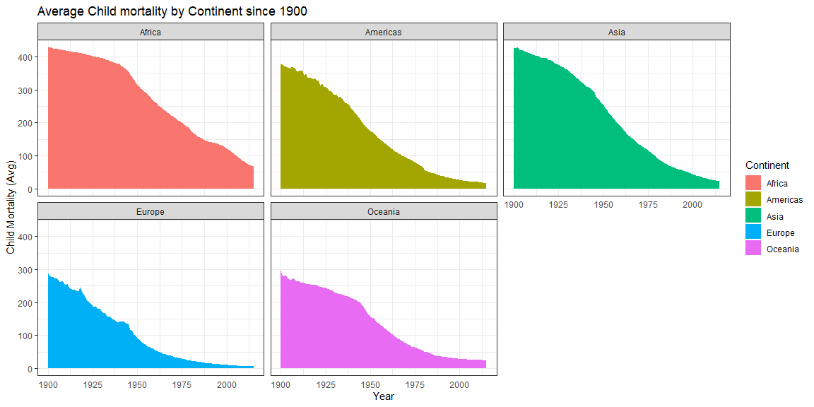

```r
# Use this R-Chunk to import all your datasets!
#install.packages("devtools")
library(devtools)
healthcare <- ourworldindata::financing_healthcare
childMortality <- ourworldindata::child_mortality
```

## Background

Take notes on your reading of the specified ‘R for Data Science’ chapter in the README.md or in a ‘.R’ script in the class task folder.
Review the Our World in Data (Links to an external site.) webpage and find a graphic that interests you.
Recreate that graphic in R as close as possible after downloading the data from their website.
Explore the world data on financing_healthcare and create an interesting graphic that highlights this dataset in relation to child mortality.
Use devtools::install_github("drsimonj/ourworldindata") to get a larger dataset on financing_healthcare.
Create a graphic that you could use in a final presentation to summarize world child mortality (child_mort column).
Push your .Rmd, .md, and .html to your GitHub repo.

## Data Wrangling


```r
# Use this R-Chunk to clean & wrangle your data!
childMortality$continent <- as.factor(childMortality$continent)
childMortality$country <- as.factor(childMortality$country)

childMortality <- filter(childMortality, year >= 1900)
childMortality <- childMortality %>% drop_na(child_mort)
childMortality <- childMortality %>% drop_na(continent)
#means <- favstats(child_mort ~ continent, data=childMortality)
means <- childMortality %>% 
        group_by(continent, year) %>% 
        summarise(childmortM = mean(child_mort))


#------------------------------------------------------------


healthcare$HEPerGDP <- healthcare$health_exp_total / healthcare$gdp
#healthcare$nhs_expPer <- case_when(healthcare$nhs_exp >= .8 ~ "80%+" , healthcare$nhs_exp >= .6 & healthcare$nhs_exp < 0.8 ~"60%-79%")
healthcare$continentUS <- case_when(healthcare$country == "United States" ~ "Americas(US)", healthcare$country != "United States" & healthcare$continent == "Americas" ~ "Americas(Not US)", healthcare$continent != "Americas" ~ healthcare$continent)
healthcare2 <- healthcare %>% drop_na(HEPerGDP)
healthcare2 <- healthcare2 %>% drop_na(continent)
```

## Data Visualization


```r
# Use this R-Chunk to plot & visualize your data!

ggplot(data=means, ) +
    geom_area(aes(x=year, y=childmortM, fill= continent)) +
    theme_bw() +
    facet_wrap(~continent) +
    theme(
      panel.spacing = unit(0.5, "lines"),
      axis.ticks.x=element_blank()
    )+ 
  labs(fill = "Continent", title= "Average Child mortality by Continent since 1900")+ 
  xlab("Year") + ylab("Child Mortality (Avg)")
```

<!-- -->

```r
ggplot(data=healthcare2, ) +
    geom_histogram(aes(x=HEPerGDP, fill= continentUS)) +
    #geom_area(aes(x=HEPerGDP,y=child_mort, fill= continent))+
    theme_bw() +
    gghighlight::gghighlight() +
    facet_wrap(~continentUS) +
    theme(
      panel.spacing = unit(0.5, "lines"),
      axis.ticks.x=element_blank()
    )+ 
  labs(fill = "Continent", title= "Child mortality by Total Health Expediture % of GDP")+ 
  xlab("Health Expenditures (% of GDP)") + ylab("Child Mortality per 1000")
```

<!-- -->

## Conclusions

Overall world child mortality is right skewed, Oceania and Europe are the most normally distributed continents, with Asia and Africa representing the most of the left tail within the distribution. I separated the United States from the remainder of the Americas to highlight its location. The General pattern that we can observe here is that there is a large and relatively universal drop in child mortality between countries consuming at least 5% of GDP into Health Care expenses and those consuming less than 5% of GDP on health care.
